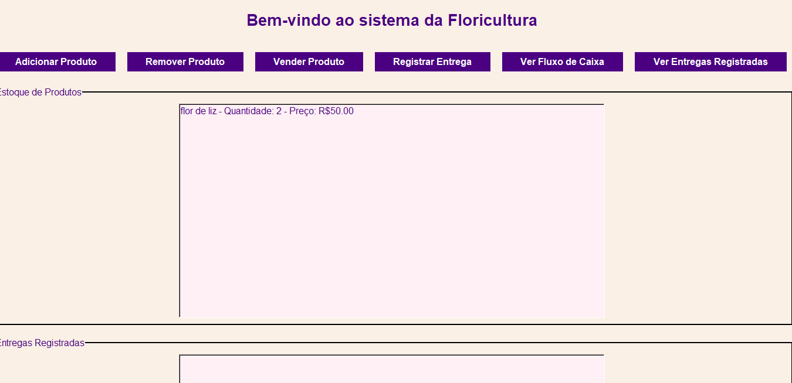
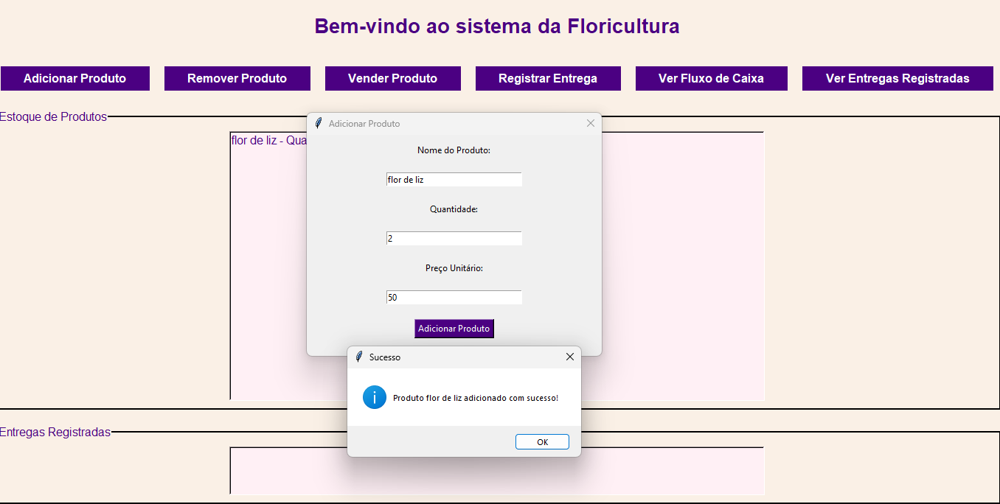

# Sistema de Gerenciamento de Floricultura 🌸  
**Projeto Integrador - Engenharia de Software**

Este sistema foi desenvolvido como parte de um projeto integrador por uma equipe de **5 estudantes** do curso de Engenharia de Software. Ele tem como objetivo oferecer uma solução prática e funcional para o gerenciamento de floriculturas, incluindo controle de estoque, vendas, entregas e fluxo de caixa.

---

## 🛠️ Principais Funcionalidades  
O sistema permite:  
- **Gerenciamento de Estoque**: Adicionar, remover e visualizar produtos disponíveis.  
- **Gestão de Vendas**: Registrar vendas com atualização automática do estoque e fluxo de caixa.  
- **Controle de Entregas**: Registrar pedidos entregues e consultar histórico.  
- **Fluxo de Caixa**: Exibir o saldo atualizado em tempo real.

## 🖼️ Demonstração Visual  
### Tela Principal  



 

### Adicionar Produto  



## 🚀 Instruções para Execução  

### Pré-requisitos  
- **Python**: Versão 3.8 ou superior.  
- **Bibliotecas Necessárias**:  
  - `tkinter` (embutido no Python).  
  - `os` e `json` (módulos padrão do Python).  

### Passos para Configuração  
1. **Clone o Repositório**:  
   ```bash
   git clone https://github.com/seu-usuario/floricultura.git
   ```  

2. **Acesse o Diretório do Projeto**:  
   ```bash
   cd floricultura
   ```  

3. **Execute o Arquivo Principal**:  
   ```bash
   python floricultura.py
   ```  

---

## 📁 Estrutura do Projeto  

```plaintext
floricultura/
├── floricultura.py         # Código principal
├── dados_floricultura.json # Base de dados gerada automaticamente
├── Prints/                 # Pasta com capturas de tela do sistema
└── README.md               # Documentação do projeto
```

---

## 💻 Detalhes Técnicos  

Este sistema foi desenvolvido utilizando:  
- **Python**: Para toda a lógica de negócio e interface gráfica.  
- **Tkinter**: Biblioteca padrão para criar interfaces amigáveis e funcionais.  
- **JSON**: Persistência de dados local em um arquivo gerado automaticamente.  
- **Programação Orientada a Objetos**: Organização clara e escalável do código.

### Benefícios Técnicos  
- **Persistência Local**: O arquivo `dados_floricultura.json` armazena as informações para garantir que os dados sejam mantidos mesmo após o encerramento do sistema.  
- **Interface Dinâmica**: A interface gráfica atualiza automaticamente as informações de estoque e fluxo de caixa.  

---

## 📝 Observações  

1. O arquivo `dados_floricultura.json` será criado automaticamente na primeira execução.  
2. O sistema salva os dados após cada operação, garantindo a integridade das informações.  
3. O projeto foi planejado e implementado seguindo boas práticas de desenvolvimento de software.  

---

## 📋 Avaliação e Sugestões  

**Para os Avaliadores:**  
- Testem todas as funcionalidades descritas.  
- Avaliem a usabilidade da interface gráfica.  
- Analisem o fluxo de dados e o uso do JSON para persistência.  

**Para Usuários Futuros:**  
- Sugestões e melhorias são bem-vindas!  

## ✨ Equipe de Desenvolvimento  

| Nome                |  
|--------------------|  
|Vanessa Borges |  
|Marcos Luke |  
|Felipe Ferreira|  
 Milena de Carvalho|  
|Isabella Lourenço |  
